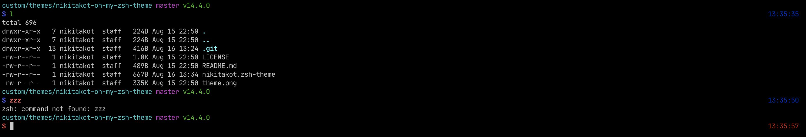

# nikitakot-oh-my-zsh-theme

Small and simple oh-my-zsh theme.
Shows current directory and 2 directories behind, 
git branch (requires git > 2.22 installed) and nodejs version. 



```sh
$ git clone https://github.com/nikitakot/nikitakot-oh-my-zsh-theme.git "$ZSH_CUSTOM/themes/nikitakot-oh-my-zsh-theme"
$ ln -s "$ZSH_CUSTOM/themes/nikitakot-oh-my-zsh-theme/nikitakot.zsh-theme" "$ZSH_CUSTOM/themes/nikitakot.zsh-theme"
# Edit ~/.zshrc to set ZSH_THEME="nikitakot"
```
